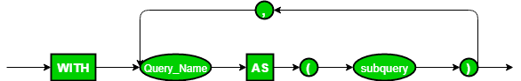

# with clause

## 0. Table Of Contents

1. Introduction
2. Syntax
3. How it works
4. Queries
5. When to use
6. Conclusion

## 1. Introduction

````
SQL WITH clause, also known as subquery refactoring or common table expressions(CTEs)is used for creating a temporary result set using a simple sql query, 
such that thistemporary set can further be used multiple times within the main SELECT, INSERT,UPDATE or DELETE statements,  
i.e, WITH clause creates a temporary virtual table withcan be further used in main SQL queries.
````
- The clause is used for defining a temporary relation such that the output of this temporary relation is available and
  is used by the query that is associated with theWITH clause.
- Queries that have an associated WITH clause can also be written using nested-sub-queries but doing so add more
  complexity to read/debug the SQL query.
- WITH clause is not supported by all database system.
- The name assigned to the sub-query is treated as though it was an inline view or table

## 2. Syntax

````sql
-- Define the CTE(temporary table) name and column list
WITH temp_table_name ( column_name1, column_name2, ...)
AS
-- Define the CTE query
(
SELECT column_name1, column_name2
FROM table_name1
WHERE condition
)
-- Define the main query
SELECT column_name1, column_name2
FROM temp_table_name;
````

- WITH: With clause is used for creating a common table expression or temporary tables
- temp_table_name ( column_name1, column_name2, …): Here, temp_table_name is the name of CTE and ( column_name1, column_name2, …) is the definition of column names of the CTE which we will be using further in the main query.
- AS (SELECT column_name1, column_name2 FROM table_name1 WHERE condition): This section specifies a SELECT statement whose result set will populate the CTE.
- SELECT column_name1, column_name2 FROM temp_table_name: This section specifies the main outer query. The SELECT statement which will use the columns from the resultant CTE and produces the final result.

Of the above-mentioned parameters, all the parameters are mandatory. You may use WHERE, GROUP BY, ORDER BY and HAVING clauses based on your requirement.

````sql
WITH temporaryTable (averageValue) as
         (SELECT avg(Attr1)
          FROM Table)
SELECT Attr1
FROM Table,
     temporaryTable
WHERE Table.Attr1 > temporaryTable.averageValue;
````



In this query, WITH clause is used to define a temporary relation temporaryTable that has only 1 attribute averageValue.
averageValue holds the average value of column Attr1 described in relation Table. The SELECT statement that follows the
WITH clause will produce only those tuples where the value of Attr1 in relation Table is greater than the average value
obtained from the WITH clause statement.

Note: When a query with a WITH clause is executed, first the query mentioned within the clause is evaluated and the
output of this evaluation is stored in a temporary relation. Following this, the main query associated with the WITH
clause is finally executed that would use the temporary relation produced.

## 3. How it works

WITH clause allows us to give a subquery block a name that can be used in multiple places within the main SELECT, INSERT, DELETE or UPDATE SQL query. The name [assigned to the subquery](https://www.educba.com/postgresql-subquery/) is treated as though it was an inline view or a table.

It is very helpful when you need the same set of results data multiple times. In such a case you can simply define a CTE for this data and reuse the same again and again by referencing it. It’s a kind of code reuse.

## 4. Queries

## Example 1:

Find all the employee whose salary is more than the average salary of all employees.
Name of the relation: **Employee**

| EmployeeID | Name   | Salary |
|------------|--------|--------|
| 100011     | Smith  | 50000  |
| 100022     | Bill   | 94000  |
| 100027     | Sam    | 70550  |
| 100845     | Walden | 80000  |
| 115585     | Erik   | 60000  |
| 1100070    | Kate   | 69000  |

### SQL Query

````sql
WITH temporaryTable(averageValue) as
         (SELECT avg(Salary)
          from Employee)
SELECT EmployeeID, Name, Salary
FROM Employee,
     temporaryTable
WHERE Employee.Salary > temporaryTable.averageValue;
````

### Output

| EmployeeID | Name   | Salary |
|------------|--------|--------|
| 100022     | Bill   | 94000  |
| 100845     | Walden | 80000  |

### Explanation:

The average salary of all employees is 70591. Therefore, all employees whose salary is more than the obtained average
lies in the output relation.

## Example 2:

Find all the airlines where the total salary of all pilots in that airline is more than the average of total salary of
all pilots in the database.

Name of the relation: **Pilot**

| EmployeeID | Airline    | Name   | Salary |
|------------|------------|--------|--------|
| 70007      | Airbus 380 | Kim    | 60000  |
| 70002      | Boeing     | Laura  | 20000  |
| 10027      | Airbus 380 | Will   | 80050  |
| 10778      | Airbus 380 | Warren | 80780  |
| 115585     | Boeing     | Smith  | 25000  |
| 114070     | Airbus 380 | Katy   | 78000  |

### SQL Query

````sql
WITH totalSalary(Airline, total) as
       (SELECT Airline, sum(Salary)
        FROM Pilot
        GROUP BY Airline),
     airlineAverage(avgSalary) as
       (SELECT avg(Salary)
        FROM Pilot )
SELECT Airline
FROM totalSalary, airlineAverage
WHERE totalSalary.total > airlineAverage.avgSalary;
````

### Output

| Airline    |
|------------|
| Airbus 380 |

### Explanation:

The total salary of all pilots of Airbus 380 = 298,830 and that of Boeing = 45000.  
Average salary of all pilots in the table Pilot = 57305. Since only the total salary of all pilots of Airbus 380 is greater than the average salary obtained, so Airbus 380 lies in the output relation. 

### Important points 

- The SQL WITH clause is good when used with complex SQL statements rather than simple ones
- It also allows you to break down complex SQL queries into smaller ones which make it easy for debugging and processing the complex queries.
- The SQL WITH clause is basically a drop-in replacement to the normal sub-query.

## 5. When to use

So, when do you really need to use a WITH Clause? Well, there are a few unique use cases. Most of them are geared towards convenience and ease of query development and maintenance.

The standout applications and associated benefits of SQL CTEs can be summarized as:

- **Improves Code Readability** – Literate programming is an approach introduced by Donald Kuth, which aims to arrange source code in the order of human logic such that it can be understood with minimal effort by reading it like a novel in a sequential manner. The SQL WITH clause helps do just that by creating virtual named tables and breaking large computations into smaller parts. They can then be combined later in the query in the final SELECT, or another statement, instead of lumping it all into one large chunk.
- **Improves Code Maintainability** – Going hand in hand with readability is maintainability. As your queries and databases scale up with time, there will always be the need for debugging and troubleshooting – an easier to read code is easier to maintain!
- **Alternative to a View** – CTEs can substitute for views and can SELECT, INSERT, UPDATE, DELETE, or MERGE This can be particularly useful if you do not have the system rights to create a view object or if you don’t want to create a view just to be used in a single query.
- **Overcome Statement Limitations** – CTEs help overcome constraints such as SELECT statement limitations, for example, performing a GROUP BY using non-deterministic functions.
- **Processing Hierarchical Structures** – This is one of the more advanced applications of the CTE and is accomplished through what is known as recursive CTEs. Recursive queries can call on themselves, allowing you to traverse complex hierarchical models.


## 6. Conclusion

SQL WITH clause is used for creating temporary tables that can be used further in the main SQL query. They reduce the cost of join operations and help in reusing the same piece of code again and again by referencing.

